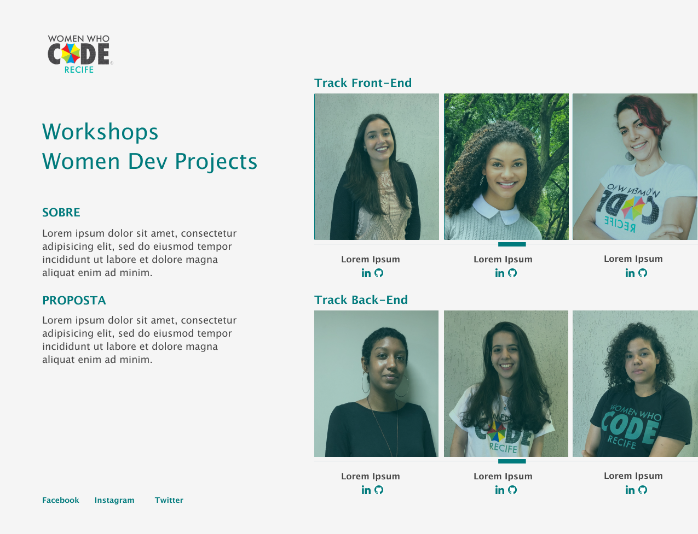

# remote_workshops_wdp
Remote workshops - tracks: front-end/back-end

#website - Landing Page with scroll and two column.

## Welcome! 👋

 

[WWcode Recife] This website will developed durant the HTML and CSS Workshops

**To do this challenge, you need a basic understanding of HTML and CSS.**

## Where to find everything

Your task is to build out the project to the designs inside the `/design` folder. You will find both a mobile and a desktop version of the design to work to. 

You will find all the required assets in the `/images` folder. The assets are already optimized.

## Building your project

1. Initialize your project as a public repository on [GitHub](https://github.com/). This will make it easier to share your code with the community if you need some help. If you're not sure how to do this, [have a read through of this Try Git resource](https://try.github.io/).
2. Configure your repository to publish your code to a URL. This will also be useful if you need some help during a challenge as you can share the URL for your project with your repo URL. There are a number of ways to do this, but we recommend using [Vercel](https://bit.ly/) or [Netlify](https://www.netlify.com/)
3. Look through the designs to start planning out how you'll tackle the project.
4. Before adding any styles, structure your content with HTML. Writing your HTML first can help focus your attention on creating well-structured content.
6. Start adding styles to the top of the page and work down. Only move on to the next section once you're happy you've completed the area you're working on.

## Deploying your project

As mentioned above, there are a number of ways to host your project for free. We recommend using [Vercel](https://bit.ly/fem-vercel) as it's an amazing service and extremely simple to get set up with. If you'd like to use Vercel, here are some steps to follow to get started:

1. [Sign up to Vercel](https://bit.ly/fem-vercel-signup) and go through the onboarding flow, ensuring your GitHub account is connected by using their [Vercel for GitHub](https://vercel.com/docs/v2/git-integrations/vercel-for-github) integration.
2. Connect your project to Vercel from the ["Import project" page](https://vercel.com/import), using the "From Git Repository" button and selecting the project you want to deploy.
3. Once connected, every time you `git push`, Vercel will create a new [deployment](https://vercel.com/docs/v2/platform/deployments) and the deployment URL will be shown on your [Dashboard](https://vercel.com/dashboard). You will also receive an email for each deployment with the URL.

## Sharing your solution

3. Tweet [@WWcode_recife](https://twitter.com/WWCode_Recife) and mention **@WWcode_recife** including the repo and live URLs in the tweet. We'd love to take a look at what you've built and help share it around. Or
4. Instagram [@wwcoderecife]
5. Facebook [wwcrecife](https://www.facebook.com/groups/wwcrecife/)
